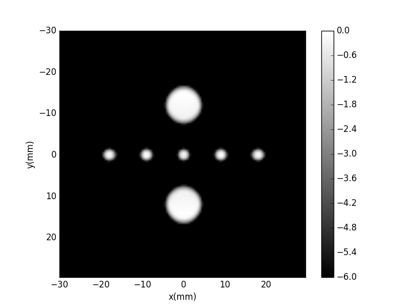

# pa_tomography_xu-wang
Replication of the algorithm demonstrated in "Universal Backprojection Algorithm for Photoacoustic Computed Tomography" published by Xu and Wang (2005) which can be found here:

http://oilab.seas.wustl.edu/epub/2005MX-PRE-Universal.pdf

This Python program should operate with the base installation of the free Spyder IDE. If using the command line interpreter, the program will run with modules listed in requirements.txt. You can of course install these packages in one shot using 

pip3 install -r requirements.txt

and doing so in a virtual environment is recommended.

Note: I wrote this while learning Python, so it's fairly unpolished. I'll touch it up and make it PEP8 eventually.

